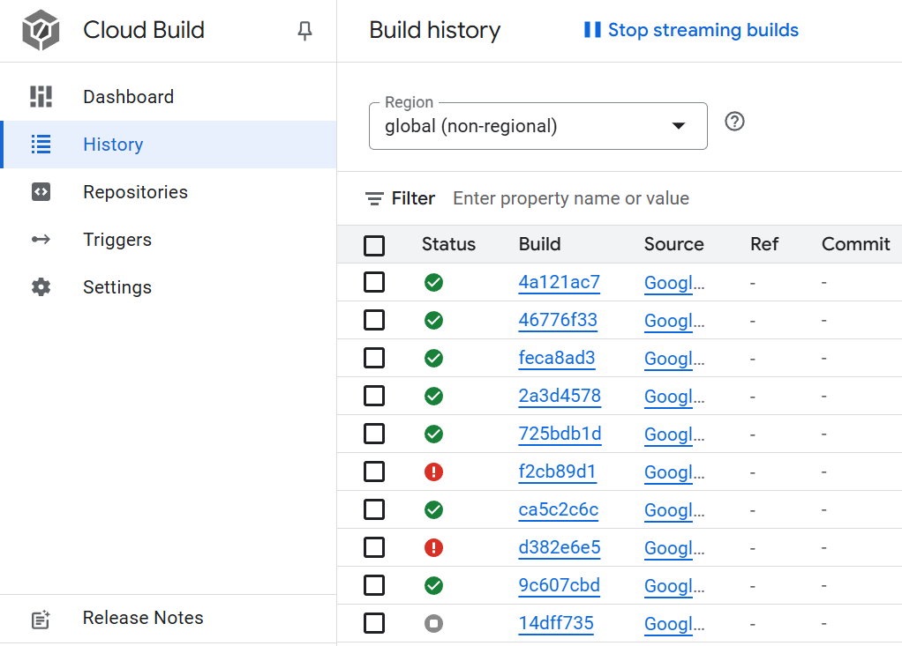

# Exam template for 02476 Machine Learning Operations

This is the report template for the exam. Please only remove the text formatted as with three dashes in front and behind
like:

```--- question 1 fill here ---```

Where you instead should add your answers. Any other changes may have unwanted consequences when your report is
auto-generated at the end of the course. For questions where you are asked to include images, start by adding the image
to the `figures` subfolder (please only use `.png`, `.jpg` or `.jpeg`) and then add the following code in your answer:

```markdown

```

In addition to this markdown file, we also provide the `report.py` script that provides two utility functions:

Running:

```bash
python report.py html
```

Will generate a `.html` page of your report. After the deadline for answering this template, we will auto-scrape
everything in this `reports` folder and then use this utility to generate a `.html` page that will be your serve
as your final hand-in.

Running

```bash
python report.py check
```

Will check your answers in this template against the constraints listed for each question e.g. is your answer too
short, too long, or have you included an image when asked. For both functions to work you mustn't rename anything.
The script has two dependencies that can be installed with

```bash
pip install typer markdown
```

## Overall project checklist

The checklist is *exhaustive* which means that it includes everything that you could do on the project included in the
curriculum in this course. Therefore, we do not expect at all that you have checked all boxes at the end of the project.
The parenthesis at the end indicates what module the bullet point is related to. Please be honest in your answers, we
will check the repositories and the code to verify your answers.

### Week 1

* [x] Create a git repository (M5)
* [x] Make sure that all team members have write access to the GitHub repository (M5)
* [x] Create a dedicated environment for you project to keep track of your packages (M2)
* [x] Create the initial file structure using cookiecutter with an appropriate template (M6)
* [x] Fill out the `data.py` file such that it downloads whatever data you need and preprocesses it (if necessary) (M6)
* [x] Add a model to `model.py` and a training procedure to `train.py` and get that running (M6)
* [x] Remember to fill out the `requirements.txt` and `requirements_dev.txt` file with whatever dependencies that you
    are using (M2+M6)
* [x] Remember to comply with good coding practices (`pep8`) while doing the project (M7)
* [x] Do a bit of code typing and remember to document essential parts of your code (M7)
* [x] Setup version control for your data or part of your data (M8)
* [ ] Add command line interfaces and project commands to your code where it makes sense (M9)
* [x] Construct one or multiple docker files for your code (M10)
* [x] Build the docker files locally and make sure they work as intended (M10)
* [x] Write one or multiple configurations files for your experiments (M11)
* [x] Used Hydra to load the configurations and manage your hyperparameters (M11)
* [x] Use profiling to optimize your code (M12)
* [x] Use logging to log important events in your code (M14)
* [x] Use Weights & Biases to log training progress and other important metrics/artifacts in your code (M14)
* [x] Consider running a hyperparameter optimization sweep (M14)
* [x] Use PyTorch-lightning (if applicable) to reduce the amount of boilerplate in your code (M15)

### Week 2

* [x] Write unit tests related to the data part of your code (M16)
* [x] Write unit tests related to model construction and or model training (M16)
* [x] Calculate the code coverage (M16)
* [x] Get some continuous integration running on the GitHub repository (M17)
* [ ] Add caching and multi-os/python/pytorch testing to your continuous integration (M17)
* [x] Add a linting step to your continuous integration (M17)
* [x] Add pre-commit hooks to your version control setup (M18)
* [ ] Add a continues workflow that triggers when data changes (M19)
* [ ] Add a continues workflow that triggers when changes to the model registry is made (M19)
* [x] Create a data storage in GCP Bucket for your data and link this with your data version control setup (M21)
* [ ] Create a trigger workflow for automatically building your docker images (M21)
* [x] Get your model training in GCP using either the Engine or Vertex AI (M21)
* [x] Create a FastAPI application that can do inference using your model (M22)
* [x] Deploy your model in GCP using either Functions or Run as the backend (M23)
* [x] Write API tests for your application and setup continues integration for these (M24)
* [x] Load test your application (M24)
* [ ] Create a more specialized ML-deployment API using either ONNX or BentoML, or both (M25)
* [ ] Create a frontend for your API (M26)

### Week 3

* [ ] Check how robust your model is towards data drifting (M27)
* [ ] Deploy to the cloud a drift detection API (M27)
* [ ] Instrument your API with a couple of system metrics (M28)
* [ ] Setup cloud monitoring of your instrumented application (M28)
* [ ] Create one or more alert systems in GCP to alert you if your app is not behaving correctly (M28)
* [ ] If applicable, optimize the performance of your data loading using distributed data loading (M29)
* [ ] If applicable, optimize the performance of your training pipeline by using distributed training (M30)
* [ ] Play around with quantization, compilation and pruning for you trained models to increase inference speed (M31)


### Extra

* [x] Write some documentation for your application (M32)
* [ ] Publish the documentation to GitHub Pages (M32)
* [x] Revisit your initial project description. Did the project turn out as you wanted?
* [x] Create an architectural diagram over your MLOps pipeline
* [x] Make sure all group members have an understanding about all parts of the project
* [x] Uploaded all your code to GitHub

## Group information

### Question 1
> **Enter the group number you signed up on <learn.inside.dtu.dk>**
>
> Answer:

MLOPS 15

### Question 2
> **Enter the study number for each member in the group**
>
> Answer:

s243906, s243933, s243660, s243896

### Question 3
> **A requirement to the project is that you include a third-party package not covered in the course. What framework**
> **did you choose to work with and did it help you complete the project?**
>
> Answer:

We used the third-party framework Black in our project. Black is an automatic code formatter that ensures a consistent code style by reformatting Python code according to the PEP 8 standards. We used the functionlity of Black's pre-commit hook to integrate it into our continuous integration workflow. This allowed us to automatically check the formatting of our code with each commit made, ensuring that all code maintains the same style without any manual intervention. The pre-commit integration helped us maintain clean and readable code throughout the project, improving both collaboration and code quality.

## Coding environment

> In the following section we are interested in learning more about you local development environment. This includes
> how you managed dependencies, the structure of your code and how you managed code quality.

### Question 4

> **Explain how you managed dependencies in your project? Explain the process a new team member would have to go**
> **through to get an exact copy of your environment.**
>
> Answer:

We used pip freeze to manage dependencies in our projects. We have created two separate files - requirements.txt for production dependencies and requirements_dev.txt for development tools.
Each team member worked in their own virtual environment during development. To replicaate the environment, a new team member would need to create a virtual environment using the following commands:
```
python -m venv venv
source venv/bin/activate  # For Linux/Mac
venv\Scripts\activate     # For Windows
```
Then, they would install the dependencies using:
```
pip install -r requirements.txt
pip install -r requirements_dev.txt
```
The project training is run on Google Vertex AI, which automatically create a new environment for each training job. This ensures that the environment is clean and consistent for the model training.

### Question 5

> **We expect that you initialized your project using the cookiecutter template. Explain the overall structure of your**
> **code. What did you fill out? Did you deviate from the template in some way?**
>
> Answer:

From the cookiecutter template, we have used the data, dockerfiles, src, tests, configs, and .github folders. The data folder includes two .pkl.dvc files (for train and test datasets), which are used to track and manage datasets with DVC, ensuring reproducibility. The dockerfiles folder contains two Dockerfiles: one (train.dockerfile) for containerizing the training process and another (api.dockerfile) for containerizing the deployment process.

The src/mlops_project folder contains scripts to create, train, and evaluate a ResNet18 model for classifying images from the FMNIST dataset into 10 classes. It also includes api.py, which sets up the FastAPI application for deploying the model.

In the configs folder, we maintain multiple YAML files for configuration. These include cloudbuild.yaml for automating builds in Google Cloud, config.yaml and config_cpu.yaml for training configurations, sweep.yaml for hyperparameter optimization, and vertex_ai_train.yaml for running training jobs on Vertex AI.

Additionally, we made use of GitHub Actions for CI/CD workflows. This allowed us to automate tasks like running tests, linting code, and ensuring proper integration at every stage of development.

### Question 6

> **Did you implement any rules for code quality and format? What about typing and documentation? Additionally,**
> **explain with your own words why these concepts matters in larger projects.**
>
> Answer:

We have implemented pre-commit hooks for basic code quality checks (e.g. removing trailing whitespaces or validating YAML syntax) as well as code formatting using the [black](https://black.readthedocs.io/en/stable/index.html) library. Additionally, we agreed to use type hints in our code for better understanding of each other's work and improved transparency. We found type hints essential, as they quickly show e.g. the input and output of functions, which enhances the development process.

Documentation was not a very significant part of the project, as we opted for checking each other PR's & discussing changes made. However, for bigger "sub-projects", such as the API, documentation was created.

These concepts are important as they introduce code consistency and minimize the risk of erroneous code. Furthermore, it is easier to further develop on / migrate code that is clear and understandable.

## Version control

> In the following section we are interested in how version control was used in your project during development to
> corporate and increase the quality of your code.

### Question 7

> **How many tests did you implement and what are they testing in your code?**
>
> Answer:

We have implemented 8 tests, cosisting of more "subtests". Due to the nature of our model (a pre-trained implementation), we have decided to implement basic testing of this feature. Moreover, our data does not tend to change much over time, however tests have been made for that as well, covering the instance, length, and output of various data loaders.

API testing is a significant part of our test logic. We consider it important to test the API carefully, as it is a custom, comprehensive solution. Each endpoint has various "subtests", mostly focusing on checking the response object and it's status code.

### Question 8

> **What is the total code coverage (in percentage) of your code? If your code had a code coverage of 100% (or close**
> **to), would you still trust it to be error free? Explain you reasoning.**
>
> Answer:

In order to assess code coverage, one has to specify a source directory. We have decided that the scope should be big and went for the whole src/ as our source directory. We managed to implement tests only for data.py, model.py, and api.py. That is why our coverage is only 13%, but we would in the future extend the scope to other files in src/. Additionaly, we focused on testing the model itself, rather than it's file (model.py), which we could also include in next iteration of testing. Overall, we are content with the code coverage for the listed files, but the lack of time prevented us to expand the test to the whole src/ module and resulted with a low code coverage.

Achieving 100% code coverage would not guarantee the code is error-free. Code coverage measures which lines of code are executed by tests, but it doesn not assess the quality of the tests temselves. So, for example, even a 100% code coverage rate could miss edge cases or, once in production, fail due to external dependencies. High coverage is a good indicator of thorough testing, but true reliability requires a combination of high-quality and meaningful tests.

### Question 9

> **Did you workflow include using branches and pull requests? If yes, explain how. If not, explain how branches and**
> **pull request can help improve version control.**
>
> Answer:

We have used both branches and pull requests (PRs) in our project. Each team member created their own branch to work on a specific tasks on the project checklist. This allowed us to work in parallel without interfering with each other's work. Once a task was completed, a pull request was submitted to merge the branch into the main branch. Other team members reviewed the pull request before it was approved and merged to main. After merging, the branch was deleted to keep the repository clean. Using this workflow helped us manage changes efficiently, avoid conflicts, and maintain a stable main branch. It also helped our collaboration because only reviewed and tested code made it to the main.

### Question 10

> **Did you use DVC for managing data in your project? If yes, then how did it improve your project to have version**
> **control of your data. If no, explain a case where it would be beneficial to have version control of your data.**
>
> Answer:

We did use DVC in our project for managing data. Instead of uploading the data directly to GitHub, we stored the training and testing datasets as `train_data.pkl` and `test_data.pkl`. Using DVC helps decouple the data from the code, ensuring that our project remain lightweight and scalable. If we hadn't used DVC, managing multiple versions of the processed data and syncronizing the changes

### Question 11

> **Discuss you continuous integration setup. What kind of continuous integration are you running (unittesting,**
> **linting, etc.)? Do you test multiple operating systems, Python  version etc. Do you make use of caching? Feel free**
> **to insert a link to one of your GitHub actions workflow.**
>
> Answer:

We have organized our continuous integration (CI) setup using GitHub Actions, focusing on unit testing, automated formatting, and coverage. The CI pipeline tests our code across multiple operating systems (Ubuntu, macOS, and Windows) and Python versions (3.11 and 3.12). The CI workflow consists of the following components:
* We use pytest for running unit tests to ensure that the code functions as expected.
* Black is used for consistent code formatting, ensuring the code follows the style guide automatically.
* We use pre-commit hooks to run checks on code quality, including linting and formatting, before code is committed.
* We use coverage.py to measure code coverage during testing. The final report is generated and uploaded as an artifact, and also, uploaded to Codecov.
*  We utilize caching for dependencies to speed up the workflow and reduce the time required for subsequent builds.
* Data version contron (DVC) is used to manage data dependencies and pull data from remote storage on Google Cloud.

An example of a triggered workflow can be seen *here: <[weblink](https://github.com/HubertWojcik10/mlops_project/actions/runs/12905913970)>*

## Running code and tracking experiments

> In the following section we are interested in learning more about the experimental setup for running your code and
> especially the reproducibility of your experiments.

### Question 12

> **How did you configure experiments? Did you make use of config files? Explain with coding examples of how you would**
> **run a experiment.**
>
> Answer:

We configured experiments using Hydra and YAML configuration files stored in the configs folder. The config.yaml file contains general project configurations, such as paths, while the sweep.yaml file is used for hyperparameter optimization. The sweep file uses the grid search method to find the best combination of hyperparameters like learning rate (lr) and batch size (batch_size) with the goal of minimizing validation loss.

In train.py, Hydra is used to load the config.yaml file. The script reads the sweep.yaml file to define the search space and initialize hyperparameter sweeps with Weights & Biases.

To update parameters directly when running the script, we could override them from the command line using Hydra syntax. For example, to specify a learning rate and batch size from the sweep file values, we can run:
```
python train.py parameters.lr=0.001 parameters.batch_size=64
```


### Question 13

> **Reproducibility of experiments are important. Related to the last question, how did you secure that no information**
> **is lost when running experiments and that your experiments are reproducible?**
>
> Answer:
We ensured reproducibility by using configuration files and tools like Hydra, DVC, and Weights & Biases (W&B). All the experiment settings, such as learning rates, batch sizes, and file paths, were saved in YAML files (config.yaml and sweep.yaml). These settings were loaded into the train.py script using Hydra, so every experiment run used the exact same configuration.

Whenever an experiment was run, Hydra saved the configuration details in a unique directory, making it easy to track which settings were used. We also used W&B to log important experiment information, such as hyperparameters, model performance, and training progress.

To reproduce an experiment, one would have to load the saved Hydra configuration or check the settings saved in W&B and run the script with the same parameters. DVC also tracked the dataset version used in the experiment, so the exact data can be restored if needed.

### Question 14

> **Upload 1 to 3 screenshots that show the experiments that you have done in W&B (or another experiment tracking**
> **service of your choice). This may include loss graphs, logged images, hyperparameter sweeps etc. You can take**
> **inspiration from [this figure](figures/wandb.png). Explain what metrics you are tracking and why they are**
> **important.**

> Answer:

In our experiments, we tracked three key metrics using Weights & Biases (W&B): training loss, validation loss, and loss per iteration across the 6 combinations from our hyperparameter sweep. These metrics help us understand how well the model is performing and guide us in adjusting the training process.

Training Loss: This metric shows how well the model is learning on the training data. A lower training loss indicates that the model is fitting the training data well. However, we must also watch the validation loss to make sure the model is not overfitting.

Validation Loss: This metric measures how well the model generalizes to new, unseen data. If the validation loss stays high while the training loss keeps decreasing, it could mean the model is overfitting to the training data and not performing well on the validation data.

Loss per Iteration: This shows how the loss changes during each iteration of the hyperparameter sweep. By tracking this, we can compare how different hyperparameter combinations affect the model’s training process.


### Question 15

> **Docker is an important tool for creating containerized applications. Explain how you used docker in your**
> **experiments/project? Include how you would run your docker images and include a link to one of your docker files.**
>
> Answer:

> For our project, we developed two images - one for training and one for deployment. The training dockerfile enables us to use Vertex AI to train a model on a VM, and the deployment dockerfile allows us to host our model and make predictions from it along with other functionality.
>
> * To generate a training docker image, run the following command from the root, `docker run -f dockerfiles/train.dockerfile . -t train:latest´ [train.dockerfile](https://github.com/HubertWojcik10/mlops_project/blob/main/dockerfiles/train.dockerfile)
> * To genereate a docker image for deployment, run the following command from the root, `docker run -f dockerfiles/api.dockerfile . -t api:latest´ [api.dockerfile](https://github.com/HubertWojcik10/mlops_project/blob/main/dockerfiles/api.dockerfile)

### Question 16

> **When running into bugs while trying to run your experiments, how did you perform debugging? Additionally, did you**
> **try to profile your code or do you think it is already perfect?**
>
> Answer:

The debugging process was mostly done using the VSCode debugger and breakpoints to step through the code. This was the easiest way for us to quickly identify and fix problems like incorrect data formats or other logic errors. We used the `torch.profiler` to analyze the performance of the code. Profiling provided valuable insights into resource utilization, such as GPU memory usage and time spent on specific operations like data loading, forward passes, and backpropagation. While we didn’t encounter any significant performance bottlenecks, this analysis helped confirm that the code was running efficiently and no critical optimizations were needed.
Although profiling and testing didn’t reveal major issues, we recognize that no code is ever truly perfect.

## Working in the cloud

> In the following section we would like to know more about your experience when developing in the cloud.

### Question 17

> **List all the GCP services that you made use of in your project and shortly explain what each service does?**
>
> Answer:

For storing our data with connection to DVC, we have used a GCP Bucket. For building docker images, we've used Google Artifact Registry. We've created various custom jobs in Vertex AI to train our model and then store it in a GCP Bucket. For API deployment, we've used GCP Cloud Runs.

### Question 18

> **The backbone of GCP is the Compute engine. Explain how you made use of this service and what type of VMs**
> **you used?**
>
> Answer:

We did not use the Compute Engine services for this project. We used Vertex AI for training as answered in Question 22.


### Question 19

> **Insert 1-2 images of your GCP bucket, such that we can see what data you have stored in it.**
>
> Answer:


In retrospective, we should have implemented a separate bucket for model storage.

### Question 20

> **Upload 1-2 images of your GCP artifact registry, such that we can see the different docker images that you have**
> **stored.**
>
> Answer:


### Question 21

> **Upload 1-2 images of your GCP cloud build history, so we can see the history of the images that have been build in**
> **your project.**
>
> Answer:




### Question 22

> **Did you manage to train your model in the cloud using either the Engine or Vertex AI? If yes, explain how you did**
> **it. If not, describe why.**
>
> Answer:

Even though the Compute Engine API has the ability to create and run VMs, the risk of being responsible to close the VMs manually and otherwise being charged led us to use Vertex AI. Vertex AI provided us the functionality of starting a VM, running a docker image, and then closing the VM once the task was done. Due to its simplicity and easy interface, we chose Vertex AI over Compute Engine. Provided that we already ran `cloudbuild.yaml` and have a docker image of the training environment in the Artifact Registry, we then run `vertex_ai_train.yaml` which uses `config_cpu.yaml` to refer to this docker image while incorporating Secrets Management in GCP to use the `WANDB_API_KEY` without us having to store it locally. Running this submits a job that performs the training on a VM and closes it when done.

## Deployment

### Question 23

> **Did you manage to write an API for your model? If yes, explain how you did it and if you did anything special. If**
> **not, explain how you would do it.**
>
> Answer:

The API was implemented using FastAPI for the Fashion-MNIST classification model. It provides three main endpoints:

1. `/sample/image` - Returns a random sample image from the train/test/val datasets as a PNG file, including the true label in response headers
2. `/predict/sample/{sample_id}` - Makes predictions on specific samples from the test dataset, returning:
  - Predicted label and index
  - True label and index
  - Model confidence score
3. `/predict/upload` - Accepts user-uploaded images for prediction, with:
  - Image preprocessing (grayscale conversion, resizing to 28x28)
  - Error handling for invalid files
  - Returns prediction and confidence score

We believe that the endpoints that we serve are "production-like", especially enabling our end-users to upload images and return the predictions of the model. Furthermore, the API includes special features like comprehensive error validation, a customized OpenAPI documentation with tags and descriptions, input validation, and other technical implementations.

The solution ensures proper model loading, tensor handling, and efficient image processing using PIL and BytesIO for effective memory management.

### Question 24

> **Did you manage to deploy your API, either in locally or cloud? If not, describe why. If yes, describe how and**
> **preferably how you invoke your deployed service?**
>
> Answer:

Yes, we managed to deploy our API in the cloud and also locally. We first tried locally serving the model which worked and instructions to it can be found under the GitHub Wiki page "Fashion MNIST API". Then, we built the API image locally, pushed it to artifact registry using Google Cloud Platform CLI, and then deployed it to Cloud Run. [URL to API](https://gcp-api-fmnist-754192913391.europe-west1.run.app/docs)

### Question 25

> **Did you perform any unit testing and load testing of your API? If yes, explain how you did it and what results for**
> **the load testing did you get. If not, explain how you would do it.**
>
> Answer:

As outlined in question 7, we have implemented API unit tests. The tests cover mostly checking the response object given a dummy model, data point, or different parameters. It was a priority to us as the API was a custom solution and wanted to ensure that it provides consistent, reproducible output. It is worth mentioning that the tests were integrated into our CI/CD workflow.

We have not load tested the API due to time constraints. We believe though that it is an important part of testing. If we were to do it, we would focus on data/model size capacity and user concurrency. When it comes to the first aspect, we would implement a "dummy" model that is e.g. 10x size of our final model (same approach with data) and measure the API response time. For user concurrency, we would simulate events of multiple instances using the API at the same time and would also measure the response time per each endpoint.

### Question 26

> **Did you manage to implement monitoring of your deployed model? If yes, explain how it works. If not, explain how**
> **monitoring would help the longevity of your application.**
>
> Answer:

We did not manage to implement monitoring. However, monitoring would be important for ensuring the reliability of the application. It would allow us to track metrics like prediction accuracy, latency, and resource usage. Monitoring could also detect data drift—changes in data distribution or the relationship between variables and outputs—which can affect performance. Additionally, it would help identify unexpected behavior in real time, enabling quick fixes such as retraining the model or adjusting the system. Logs and visualizations from monitoring tools could reveal usage patterns and help optimize the system for better performance and user experience.

## Overall discussion of project

> In the following section we would like you to think about the general structure of your project.

### Question 27

> **How many credits did you end up using during the project and what service was most expensive? In general what do**
> **you think about working in the cloud?**
>
> Answer:

We were surprised to see that we used only ~ $2.12 credits. The most expensive service was the Artifact Registry as it contains our dockerfiles needed for model building and for the FastAPI app. This cost us $1.46, and the rest is split between Vertex AI and Cloud Storage.

### Question 28

> **Did you implement anything extra in your project that is not covered by other questions? Maybe you implemented**
> **a frontend for your API, use extra version control features, a drift detection service, a kubernetes cluster etc.**
> **If yes, explain what you did and why.**
>
> Answer:

We believe that the endpoint structure of our API is a unique solution in itself as it offers users flexibility to investigate the data as well as play around with the model, both in terms of input-specific analysis, but also testing the capabilities by uploading an image and checking the response.

In order to further expand the user experiance, in the future we would implement a frontent application based on the FastAPI solution, preferrably using jinja2 for dynamic HTML rendering. Both libraries are very well-integrated. Utilizing Pydantic for more input control would also bring value.

Drift detection service would also bring value, especially if our goal was to supplement the dataset on a regular basis with new input. We could imagine an endpoint with some frontend displaying the historical drift detection logs, so that users could observe how data evolves over time.

### Question 29

> **Include a figure that describes the overall architecture of your system and what services that you make use of.**
> **You can take inspiration from [this figure](figures/overview.png). Additionally, in your own words, explain the**
> **overall steps in figure.**
>
> Answer:


The starting point of the system architecture is the local development setup. Here, Hydra and Weights and Biases are used for parameter sweeps, configuration management, and experiment tracking. The code undergoes formatting and quality checks using tools like Black (a formatter) and Pre-Commit hooks to ensure consistency before committing changes.
When the code is committed and pushed to GitHub, it triggers GitHub Actions, which automates workflows such as testing, building, and deployment. Docker images for the training pipeline and API service are built locally or as part of the CI/CD pipeline, and these images are stored in the Google Artifact Registry for reuse and deployment.
The training process is carried out on Google Vertex AI, which runs the Docker training image. During this process, DVC is used to manage and track datasets and models. Once the training completes, the updated data and models are pushed to Google Cloud Storage, ensuring versioning and easy access.
The trained model and associated data are then pulled from Google Cloud Storage for deployment. The API service is containerized and deployed to Google Cloud Run, a serverless platform for running scalable APIs. This enables the model to serve predictions efficiently in production.

### Question 30

> **Discuss the overall struggles of the project. Where did you spend most time and what did you do to overcome these**
> **challenges?**
>
> Answer:

Overall, we felt a little overwhelemed by the interdependecy of multiple frameworks and files, mainly, when building docker images and running them as we tried to incorporate the WANDB_API_KEY, granting access to pull data from DVC, and submitting training jobs, within multiple config files. To overcome these challenges, we met and worked on it together in person which helped us understand some crucial parts we were missing with the help of the lecture material.

### Question 31

> **State the individual contributions of each team member. This is required information from DTU, because we need to**
> **make sure all members contributed actively to the project. Additionally, state if/how you have used generative AI**
> **tools in your project.**
>
> Answer:

The team worked collaboratively on all aspects of the project, but certain parts were assigned to individual members. As mentioned before, we all reviewed each others work before a brach could be merged to main. Student s243906 was responsible for logging, profiling, setting up pre-commit hooks, and managing CI/CD pipelines. Student s243933 focused on Docker setup, deployment, coding practices, and integrating Google Cloud Platform (GCP). Student s243660 worked on hyperparameter sweeps, integrated Weight and Biases, built the models, and managed configurations using Hydra. Student s243896 led the setup of the Cookiecutter project template, API development, unit tests, data versioning with DVC, and deployment.
